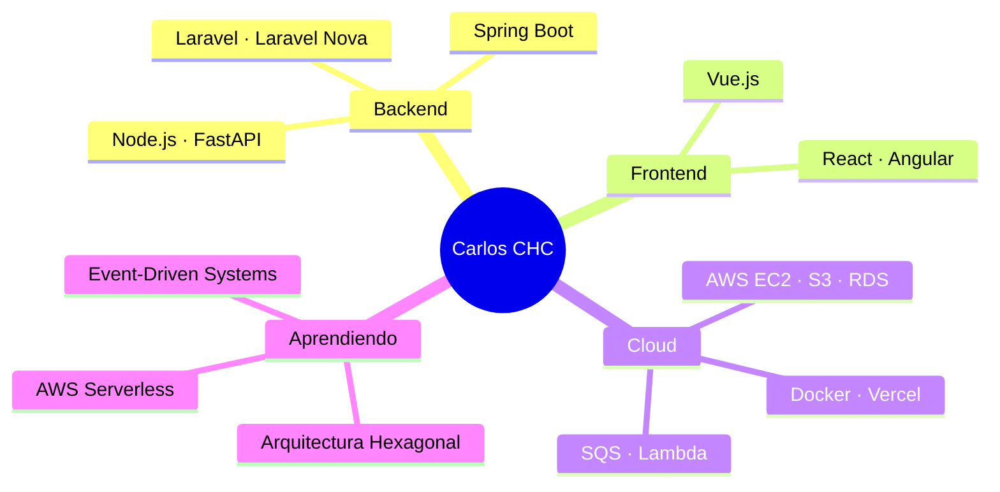

<div align="center">

<!-- HEADER ANIMADO -->


<!-- TYPING EFFECT -->
[](https://git.io/typing-svg)

<br/>

<!-- BADGES DE ESTADO -->


</div>

---

## 👋 Hola, soy Carlos

Desarrollador **Fullstack** enfocado en construir sistemas que no solo funcionen, sino que sean **escalables, mantenibles y listos para producción**.

Me muevo cómodo entre el backend complejo y el frontend limpio, y estoy evolucionando activamente hacia arquitecturas distribuidas con **AWS, Docker y event-driven systems**.

```text
🧠 Filosofía:   Clean code · Separación de responsabilidades · Escalabilidad primero
🔭 Trabajando:  POS para restaurantes · Asistencia QR · Arquitectura distribuida de logs
☁️  Aprendiendo: AWS Serverless · Docker · Arquitectura hexagonal · Event-driven systems
🤝  Buscando:   Colaborar en backend complejo, SaaS y sistemas distribuidos
📫  Contacto:   juan.carlos.jchc8@gmail.com
```

---

## 🛠️ Stack Tecnológico

<div align="center">

### ⚙️ Backend


### 🖥️ Frontend


### ☁️ Cloud & DevOps


### 🗄️ Base de datos


</div>

---

## 🚀 Proyectos en Curso

<table>
  <tr>
    <td width="50%" valign="top">
      <h3>🧾 POS para Restaurantes</h3>
      <p>Sistema de punto de venta completo con gestión de <strong>ventas, inventario y roles</strong>. Actualización en tiempo real para operaciones simultáneas de cocina y caja.</p>
      <p>
        
        
        
        
      </p>
      
    </td>
    <td width="50%" valign="top">
      <h3>🎓 Asistencia Escolar QR</h3>
      <p>Sistema de control de asistencia con <strong>códigos QR</strong>. Registro automatizado, reportes por grupo y dashboard administrativo para instituciones educativas.</p>
      <p>
        
        
        
      </p>
      
    </td>
  </tr>
  <tr>
    <td colspan="2" valign="top">
      <h3>⚙️ Arquitectura Distribuida — Procesamiento de Logs</h3>
      <p>Sistema event-driven para ingesta, procesamiento y detección de eventos en logs a escala.</p>
      <pre><code>
  [ Backend ]           [ Message Queue ]        [ Consumer ]
  Node.js / Laravel  →  AWS SQS / Queue     →    FastAPI (Python)
  Produce logs                                    Procesa & detecta eventos
      </code></pre>
      <p>
        
        
        
        
        
      </p>
      
    </td>
  </tr>
</table>

---

## 🎯 Enfoque Actual



---

## 🤝 Conectemos

<div align="center">

[](mailto:juan.carlos.jchc8@gmail.com)
[](https://linkedin.com/in/devcarloshernandez)
[](https://github.com/devCarlosHernandez)

<br/>

**Abierto a colaborar en:** `Backend complejo` · `Sistemas distribuidos` · `Productos SaaS`

<br/>


</div>
