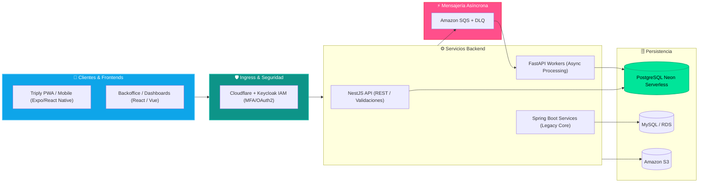

<!-- HEADER ANIMADO -->

<!-- TYPING EFFECT DINÁMICO -->

 

<!-- ACCESO RÁPIDO / CALL TO ACTIONS -->

  
  &nbsp;
  
  &nbsp;
  
  &nbsp;
  

<!-- BADGES DE ESTADO -->

  
  &nbsp;
  
  &nbsp;
  
  &nbsp;
  

---

## ⚡ Sobre Mí

Soy **Full Stack Developer & Backend Engineer** especializado en software crítico de producción. Cuento con trayectoria diseñando y desplegando **procesadores de pago financiero**, **APIs resilientes de alto tráfico** y **arquitecturas desacopladas orientadas a eventos (event-driven)**.

Domino el stack completo: desde el diseño de esquemas de datos relacionales y servicios asíncronos en **Node.js, NestJS y FastAPI sobre AWS**, hasta aplicaciones responsivas y móviles con **React, React Native (Expo) y Vue.js**.

 

<!-- TERMINAL INTERACTIVO MOCKUP -->
<table width="100%">
  <tr>
    <td style="background-color: #0f172a; border: 1px solid #1e293b; border-radius: 12px; padding: 18px 22px;">
      ●&nbsp;
      ●&nbsp;
      ●
      &nbsp;&nbsp;
      <code style="color: #94a3b8; font-family: 'Fira Code', monospace; font-size: 13px;">carlos@production-cluster: ~ (zsh)</code>
        
      <pre style="font-family: 'Fira Code', monospace; font-size: 13px; line-height: 1.6; color: #e2e8f0; margin: 0; overflow-x: auto;">
❯ <b>curl -s https://profile-personal-not3.vercel.app/api/developer</b> | jq .
{
  "name": "Carlos Hernández Cruz",
  "title": "Full Stack Developer & Backend Engineer",
  "location": "Ciudad de México, MX",
  "live_portfolio": "https://profile-personal-not3.vercel.app/",
  "current_production": {
    "company": "Métricas (Fintech)",
    "flagship_app": "Triply (PWA & Mobile Travel Planner)",
    "app_url": "https://triply-app-six.vercel.app/login"
  },
  "core_strengths": [
    "Event-Driven Architectures (Amazon SQS + Workers)",
    "High-Availability APIs (NestJS · FastAPI · Node.js)",
    "Enterprise Security (Keycloak IAM · Cloudflare · MFA)",
    "Cross-Platform UIs (React · React Native · Expo PWA)"
  ],
  "philosophy": "Sistemas tolerantes a fallos, medibles y seguros desde el diseño."
}
</pre>
    </td>
  </tr>
</table>

 

<!-- MÉTRICAS DE IMPACTO EN PRODUCCIÓN -->

### 📊 Impacto Cuantificado en Sistemas Reales

<table>
  <tr align="center">
    <td width="25%">
      <h2 style="color: #0d9488; margin-bottom: 2px;">⚡ -70%</h2>
      <b>Latencia en Consultas</b> 
      <small style="color: #64748b;">Optimización SQL & Hibernate en bases de datos MySQL</small>
    </td>
    <td width="25%">
      <h2 style="color: #0ea5e9; margin-bottom: 2px;">🧪 250+</h2>
      <b>Tests Automatizados</b> 
      <small style="color: #64748b;">114 pruebas unitarias + 136 tests E2E en Triply</small>
    </td>
    <td width="25%">
      <h2 style="color: #6366f1; margin-bottom: 2px;">🚀 80+</h2>
      <b>Endpoints REST</b> 
      <small style="color: #64748b;">Arquitectura modular desacoplada y validada</small>
    </td>
    <td width="25%">
      <h2 style="color: #10b981; margin-bottom: 2px;">📉 -50%</h2>
      <b>Tiempo de Carga</b> 
      <small style="color: #64748b;">Mejora sustancial de rendimiento en plataformas web</small>
    </td>
  </tr>
</table>

---

## 🛠️ Arsenal Tecnológico

| Categoría | Tecnologías & Herramientas |
| :--- | :--- |
| **⚙️ Backend & APIs** |          |
| **📱 Frontend & Mobile** |       |
| **☁️ Cloud & Infraestructura** |       |
| **🗄️ Bases de Datos & ORMs** |      |
| **🛡️ Seguridad & DevOps** |     |

---

## 🚀 Proyectos y Sistemas Destacados

<table>
  <!-- TRIPLY Y FINTECH -->
  <tr>
    <td width="50%" valign="top">
      

        <h3>✈️ Triply — Travel Planner & Expense Engine</h3>
        
<b>Aplicación Multiplataforma (iOS · Android · Web PWA)</b>

      

      
Sistema integral para viajeros con gestión de itinerarios, conciliación de gastos multidivisa en tiempo real y arquitectura orientada a alta disponibilidad.

      <ul>
        <li><b>Backend desacoplado:</b> 80+ endpoints REST desarrollados con <b>NestJS</b> y <b>Prisma</b> sobre PostgreSQL Serverless (<b>Neon</b>).</li>
        <li><b>Frontend PWA:</b> <b>React Native / Expo</b> con responsive desktop framing, control de notch en iOS y offline service-worker.</li>
        <li><b>Calidad demostrada:</b> 250 pruebas automatizadas (114 unitarias + 136 E2E).</li>
      </ul>
      

        
      

      

        
        
        
        
          
        
      

    </td>
    <td width="50%" valign="top">
      

        <h3>💳 Procesador de Pagos Financieros</h3>
        
<b>Fintech de Producción Crítica @ Métricas</b>

      

      
Ecosistema transaccional de alta criticidad para el procesamiento seguro de pagos monetarios con arquitectura orientada a eventos.

      <ul>
        <li><b>Colas asíncronas:</b> Ingesta y distribución con <b>Amazon SQS</b>, políticas de reintento y procesamiento de Dead Letter Queues (DLQ).</li>
        <li><b>Microservicios:</b> Backend distribuido construido con <b>Node.js</b> y <b>FastAPI</b>.</li>
        <li><b>Seguridad bancaria:</b> Autenticación e identidad corporativa mediante <b>Keycloak IAM</b>, flujos MFA, protección Cloudflare y hardening de endpoints.</li>
      </ul>
      

        
      

      

        
        
        
        
        
          
        
      

    </td>
  </tr>
  <!-- ESFERA MÉDICA Y TEC GURUS -->
  <tr>
    <td width="50%" valign="top">
      

        <h3>🏥 Plataforma Médica & ERP Clínico</h3>
        
<b>Esfera Médica</b>

      

      
Plataforma para la digitalización y gestión de expedientes clínicos y administración de citas de salud.

      <ul>
        <li>Panel administrativo modular implementado con <b>Laravel Nova</b> reduciendo el tiempo de capacitación interna en un 60%.</li>
        <li>Frontend dinámico en <b>Vue.js</b> con <b>50% de mejora</b> en tiempos de renderizado.</li>
        <li>Ambientes estandarizados y reproducibles mediante <b>Docker</b>.</li>
      </ul>
      

        
        
        
        
          
        
      

    </td>
    <td width="50%" valign="top">
      

        <h3>🏛️ Microservicios de Alto Rendimiento</h3>
        
<b>Tec Gurus</b>

      

      
Infraestructura de microservicios empresariales para transacciones y consultas de datos masivos concurrentes.

      <ul>
        <li>REST APIs diseñadas en <b>Spring Boot (Java)</b> bajo patrones de diseño corporativos.</li>
        <li><b>70% de reducción</b> en el tiempo de ejecución de queries complejas mediante optimización de Hibernate y MySQL.</li>
        <li>Incremento del 60% en capacidad de concurrencia y escalabilidad del sistema.</li>
      </ul>
      

        
        
        
        
          
        
      

    </td>
  </tr>
  <!-- PIPELINE DE LOGS -->
  <tr>
    <td colspan="2" valign="top">
      

        <h3>⚙️ Arquitectura Distribuida — Ingesta & Procesamiento de Logs a Escala</h3>
        
<b>Pipeline Event-Driven con Amazon SQS + FastAPI + Docker</b>

      

      
Diseñado para desacoplar productores de alta frecuencia de los consumidores analíticos, garantizando cero pérdida de eventos.

      <pre><code>
  ┌─────────────────────────┐          ┌───────────────────────┐          ┌─────────────────────────┐          ┌─────────────────────────┐
  │   Servicios Clientes    │  JSON    │   Amazon SQS Buffer   │   Pull   │  FastAPI / Python Sync  │  Persist │  PostgreSQL / S3 / Logs │
  │  (Node.js / React / API)│ ───────► │   (Colas FIFO / DLQ)  │ ───────► │  (Detección de eventos) │ ───────► │  (Alertas & Dashboard)  │
  └─────────────────────────┘          └───────────────────────┘          └─────────────────────────┘          └─────────────────────────┘
      </code></pre>
      

        
        
        
        
        
          
        
      

    </td>
  </tr>
</table>

---

## 🏗️ Blueprint de Arquitectura General

```mermaid
graph LR
    subgraph Clientes["📱 Clientes & Frontends"]
        A1["Triply PWA / Mobile (Expo/React Native)"]
        A2["Backoffice / Dashboards (React / Vue)"]
    end

    subgraph Gateway["🛡️ Ingress & Seguridad"]
        GW["Cloudflare + Keycloak IAM (MFA/OAuth2)"]
    end

    subgraph Backend["⚙️ Servicios Backend"]
        B1["NestJS API (REST / Validaciones)"]
        B2["FastAPI Workers (Async Processing)"]
        B3["Spring Boot Services (Legacy Core)"]
    end

    subgraph Messaging["⚡ Mensajería Asíncrona"]
        SQS["Amazon SQS + DLQ"]
    end

    subgraph Storage["🗄️ Persistencia"]
        DB1[("PostgreSQL Neon Serverless")]
        DB2[("MySQL / RDS")]
        S3[("Amazon S3")]
    end

    Clientes --> Gateway
    Gateway --> Backend
    Backend --> SQS
    SQS --> B2
    B1 --> DB1
    B2 --> DB1
    B3 --> DB2
    Backend --> S3

    style Gateway fill:#0d9488,stroke:#14b8a6,stroke-width:2px,color:#ffffff
    style Messaging fill:#ff4f8b,stroke:#f43f5e,stroke-width:2px,color:#ffffff
    style DB1 fill:#00e599,stroke:#10b981,stroke-width:2px,color:#000000
    style Clientes fill:#0ea5e9,stroke:#38bdf8,stroke-width:2px,color:#ffffff
```

---

## 🤝 Hablemos y Conectemos

  ¿Tienes en mente un proyecto desafiante, una plataforma que necesita escalar o buscas integrar un ingeniero full stack con mentalidad de sistemas distribuidos?

 

&nbsp;

&nbsp;

&nbsp;

  

<b>Áreas de interés & colaboración:</b> 
`Sistemas Financieros & Pagos` · `APIs Críticas de Alta Concurrencia` · `Arquitecturas Event-Driven con AWS` · `Aplicaciones Multiplataforma (Expo/PWA)` · `Microservicios Resilientes`

 

<!-- FOOTER ANIMADO -->

